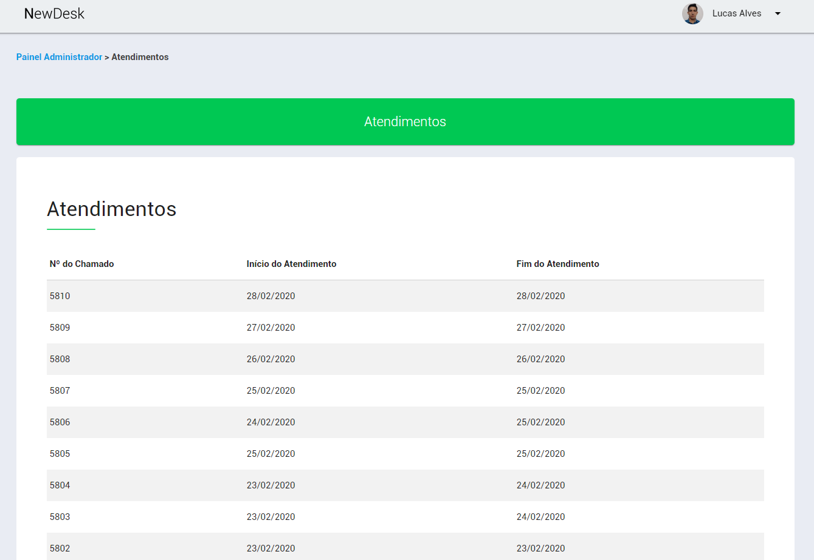

# NewDesk

Inclusão dos fontes do projeto do TCC (Estácio/AL) do curso de Engenharia de Software.

## O que se trata o NewDesk?

O NewDesk foi um projeto desenvolvido utilizando Materialize e baseando-se nos padrões do Material Design, para desenvolver o front-end de um sistema web de controle de chamados.

## Screenshots

1. Tela de Login

2. Painel Administrador

3. Situações

4. Usuários

5. Atendimentos

5. Alterar Senha

## Como posso acessar?

Para acessar e ver o projeto é muito simples, basta clicar [aqui](https://newdesk.github.io/).

## Licença

MIT ® 2020
